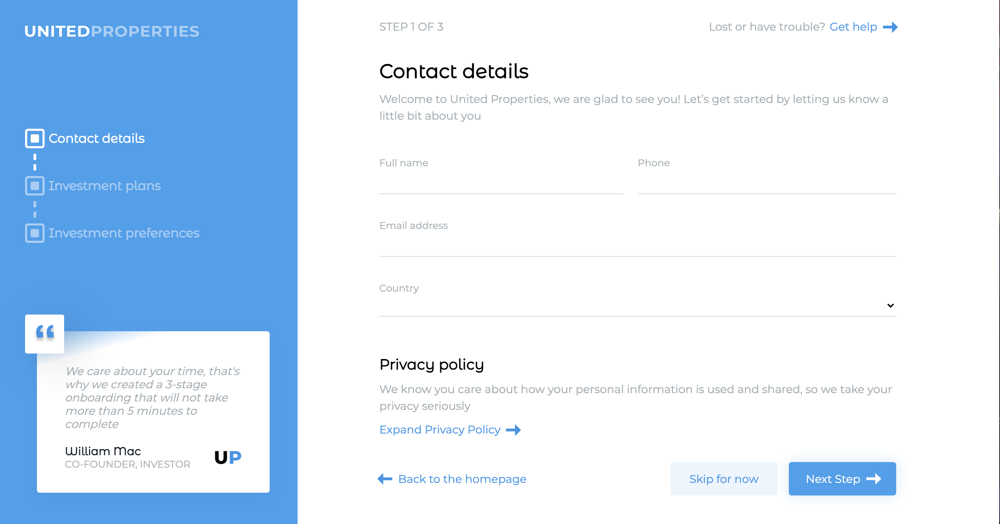

# User Onboarding


Stable Version v0.1.0

## Demo

https://react-user-onboarding.netlify.app/



## Table of Contents
* [Demo](#demo)
* [General info](#general-info)
* [Features](#features)
* [Requirements](#requirements)
* [Setup](#setup)

## General info

The purpose of this project is to learn React library, what is a component and how to handle it, the usage of the context to share the step and the user between the components. Each component was tested with Jest and React testing library.

The user has to compile the form in three steps, in each step there is the validation of the inputs value. At the end when the "Finish" button is clicked the user object is sent to the backend, in this case there is a fake call to an API.

## Features

* Languages and structure used to develop this project:
  * *JavaScript*
  * *SASS / PostCSS*
  * *HTML* templates
  * *React*
  * *Images* (*CSS backgrounds and image tags*)
  * *Fonts*
* Test the project with:
  * Latest [Jest](https://jestjs.io/) - *JavaScript* Testing Framework
  * [React Testing Library](https://testing-library.com/docs/react-testing-library/intro/) - A library to test react component
* Latest [React](https://reactjs.org/) - *JavaScript* library for building user interface
* Latest [Webpack 5](https://github.com/webpack/webpack) - *JavaScript* module bundler. 
* Latest [SASS/PostCSS](https://github.com/sass/sass) compiler based on Dart `sass`.
* Latest [Babel 7](https://github.com/babel/babel) (`@babel/core`) - JavaScript compiler - _Use next generation JavaScript, today._
* Configured and ready to use **Webpack Dev Server** plugin for faster local development - [`webpack-dev-server`](https://webpack.js.org/configuration/dev-server/)

## Requirements

* `node` : `^10 || ^12 || >=14`
* `npm`

## Setup


``` bash
# install dependencies
npm install

# build for development
npm run build

# run the project
npm run start

# run the test
npm run test

# run the test coverage
npm run test-coverage 
```
