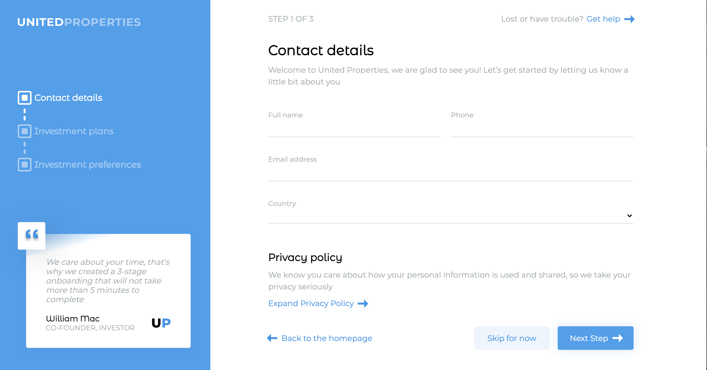

# User Onboarding

### Stable Version v0.2.0

## Demo

https://react-user-onboarding.netlify.app/

## Table of Contents
- [User Onboarding](#user-onboarding)
    - [Stable Version v0.2.0](#stable-version-v020)
  - [Demo](#demo)
  - [Table of Contents](#table-of-contents)
  - [General info](#general-info)
  - [Features](#features)
    - [Frontend](#frontend)
    - [Backend](#backend)
  - [Requirements](#requirements)
  - [Setup](#setup)
  - [Versions](#versions)

## General info

The purpose of this project is to learn React library, what is a component and how to handle it, the usage of the context to share the step and the user between the components. Each component was tested with Jest and React testing library.

The user has to compile the form in three steps, in each step there is the validation of the inputs value. At the end when the "Finish" button is clicked the user object is sent to the backend that give back a response.

## Features

### Frontend

* Languages and structure used to develop this project:
  * *JavaScript*
  * *SASS / PostCSS*
  * *HTML* templates
  * *React*
  * *Images* (*CSS backgrounds and image tags*)
  * *Fonts*
* Test the project with:
  * Latest [Jest](https://jestjs.io/) - *JavaScript* Testing Framework
  * [React Testing Library](https://testing-library.com/docs/react-testing-library/intro/) - A library to test react component
* Latest [React](https://reactjs.org/) - *JavaScript* library for building user interface
* Latest [Webpack 5](https://github.com/webpack/webpack) - *JavaScript* module bundler. 
* Latest [SASS/PostCSS](https://github.com/sass/sass) compiler based on Dart `sass`.
* Latest [Babel 7](https://github.com/babel/babel) (`@babel/core`) - JavaScript compiler - _Use next generation JavaScript, today._
* Configured and ready to use **Webpack Dev Server** plugin for faster local development - [`webpack-dev-server`](https://webpack.js.org/configuration/dev-server/)

### Backend

* Latest [Express](http://expressjs.com/) - Web framework for Node.js
* [PostgreSQL](https://www.postgresql.org/) - A realational database
* [Knex.js](https://knexjs.org/) - SQL query builder

## Requirements

* `node` : `^10 || ^12 || >=14`
* `npm`

## Setup

[Frontend README](https://github.com/AngyDev/react-user-onboarding/tree/main/client/README.md)

[Backend README](https://github.com/AngyDev/react-user-onboarding/tree/main/server/README.md)

## Versions

<strong style="color: yellow; opacity: 0.80;">v0.2.0</strong>

The main features of this version are:

- **server** folder
- **database** creation and connection. The possibility for the application to save the data on the DB
- **api** created in the frontend to call the backend application
- **translation** the possibility to use the application in Italian and English languages

<strong style="color: yellow; opacity: 0.80;">v0.1.0</strong>

The main features of this version are:
- **custom hooks** used to handle the forms of the application
- **modal** simple usage to see some information of the application
- **react context** to pass global information as step and user. The step is used to change the information on the page between the steps. The object user is global because I can maintain the information of the forms until the end of the steps. 
- **react router** there are three pages, homepage, setp2 and step3
